# 1-MySQL-Windows10安装教程.md

1. 首先进入[MySQL官网](https://www.mysql.com/)，然后一顿找呀找，找到下载页面。DOWNLOADS ---> Community ---> MySQL Community Server 

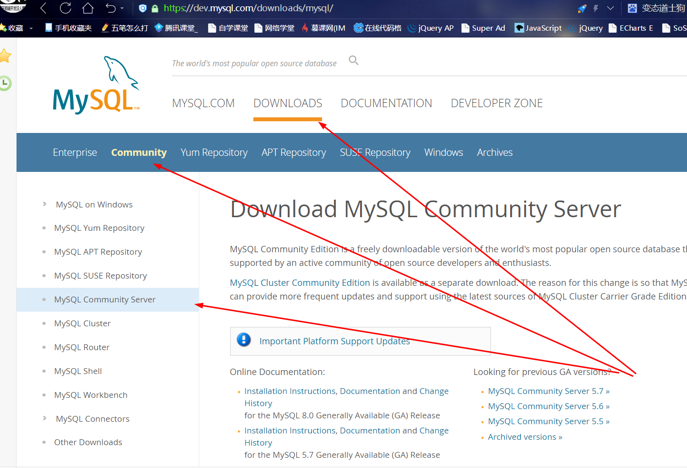

可以看到目前我们最主的版本是 8.0.16，但我们显然不用这个最新版本。。所以我们点击 [MySQL Community Server 5.7](https://dev.mysql.com/downloads/mysql/5.7.html#downloads)

2. 选择版权下载，这里以版本 5.7.26版本并且以.msi结尾的为例 

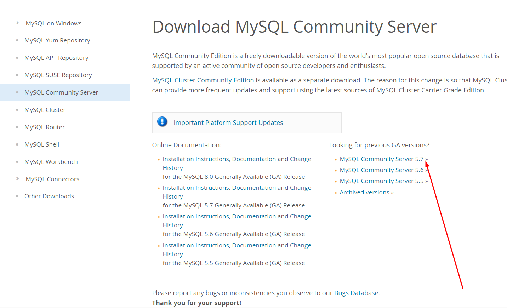

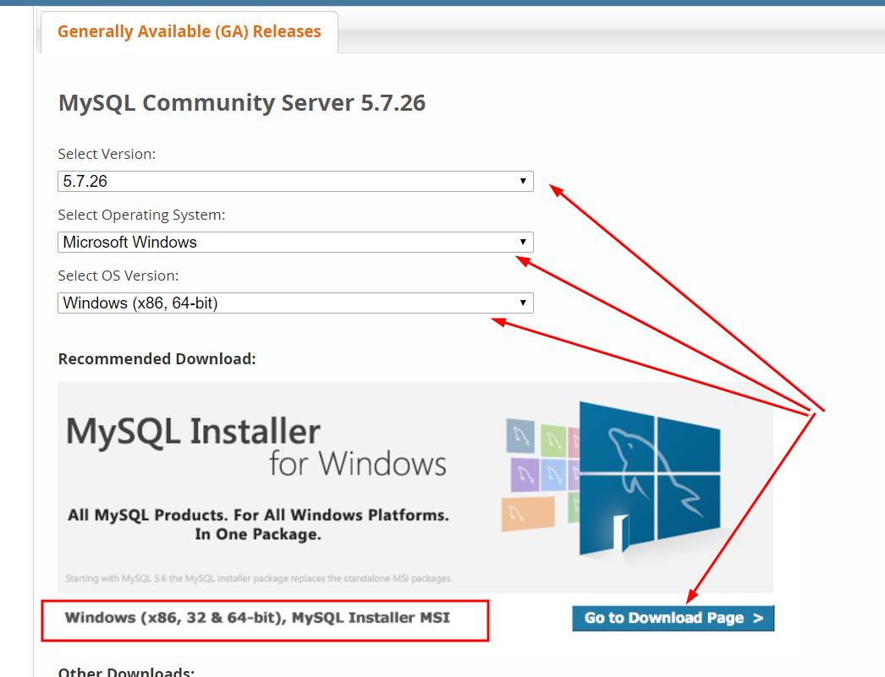

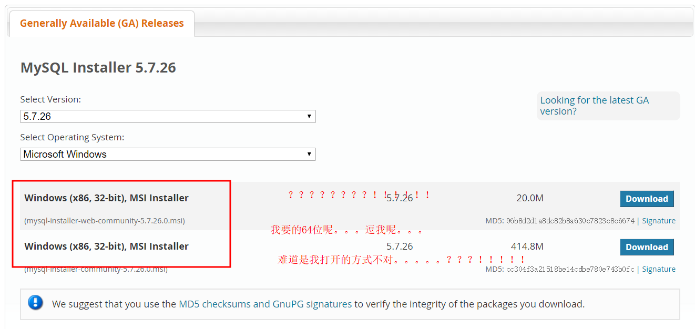

找咯半天。。这个版本的msi结尾文件只有32位的无奈只得放弃，改下.zip结尾文件

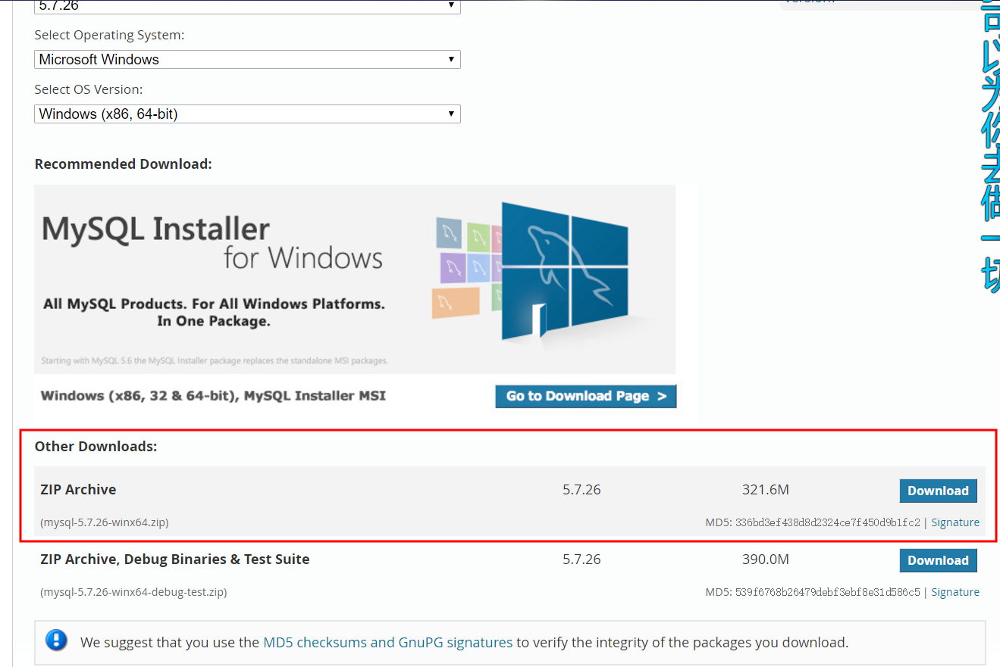

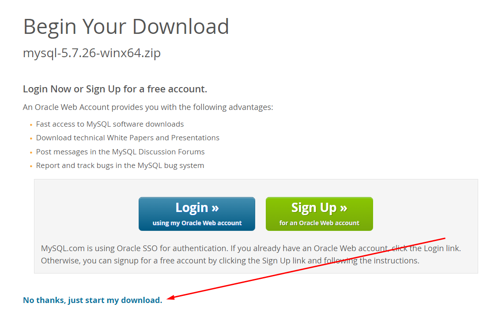

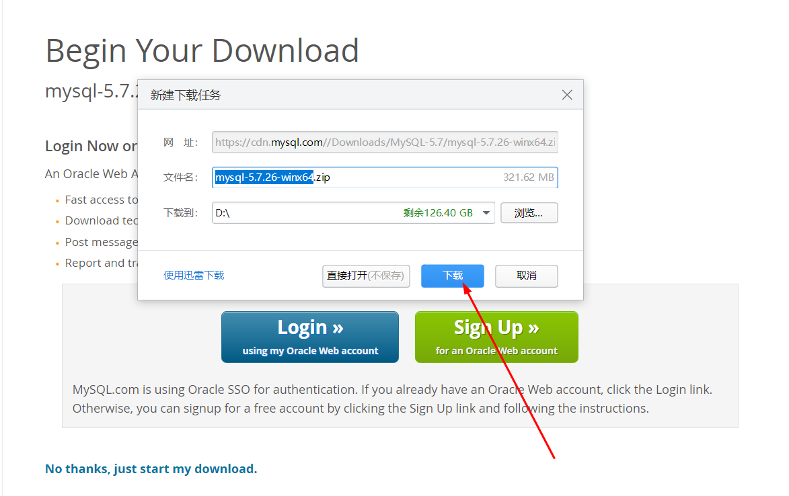

3. 解压安装

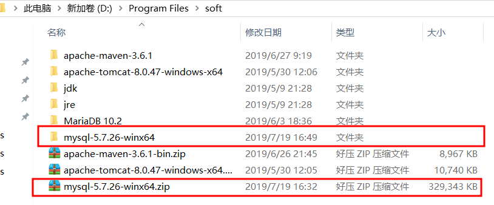

4. 配置环境变量

```
MYSQL_HOME
D:\Program Files\soft\mysql-5.7.26-winx64
```

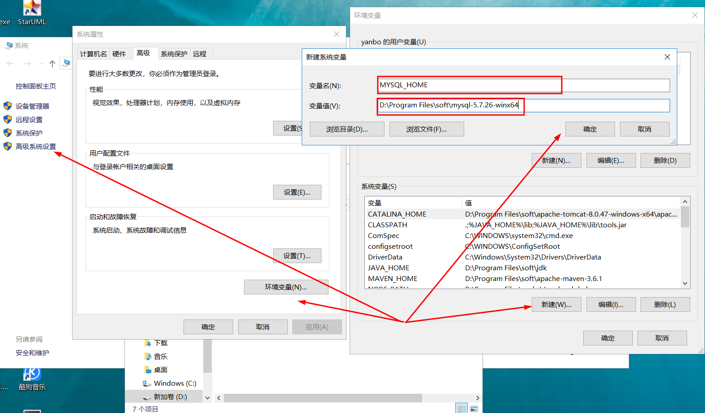

+ path里添加：%MYSQL_HOME%\bin

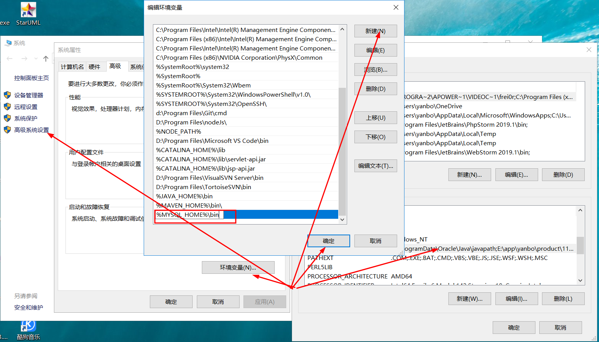

5. 生成data文件

+ 以管理员身份运行cmd

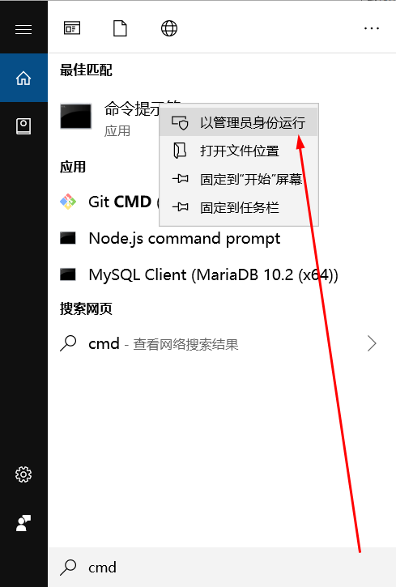

+ 进入 D:\Program Files\soft\mysql-5.7.26-winx64\bin 目录下执行命令：mysqld --initialize-insecure --user=mysql  在D:\Program Files\soft\mysql-5.7.26-winx64目录下生成data目录

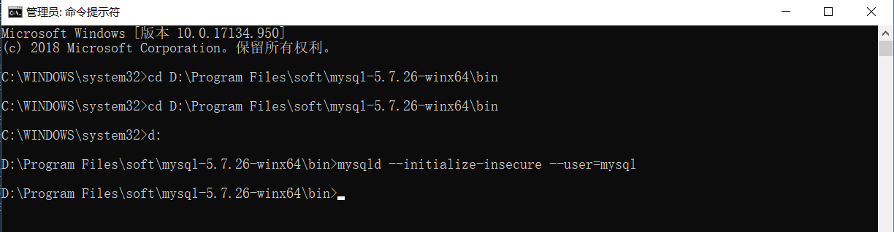

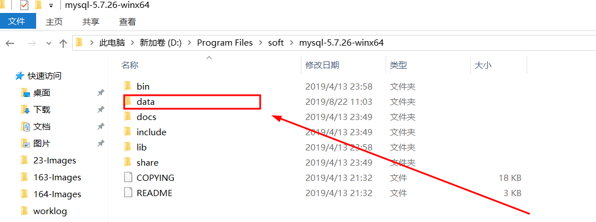

6. 执行命令 net start mysql 启动mysql服务

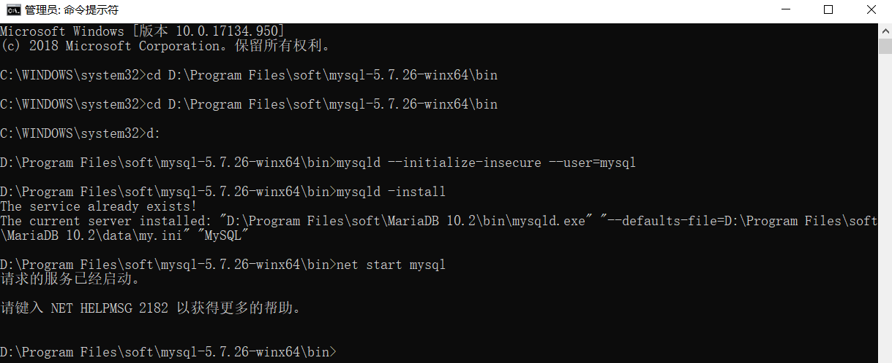

7. 登录mysql 执行命令 mysql -u root -p

+ 登录mysql:(因为之前没设置密码，所以密码为空，不用输入密码，直接回车即可）

+ 但我的之前设置过，找咯好半天才记起来密码是 root123 。。。。。

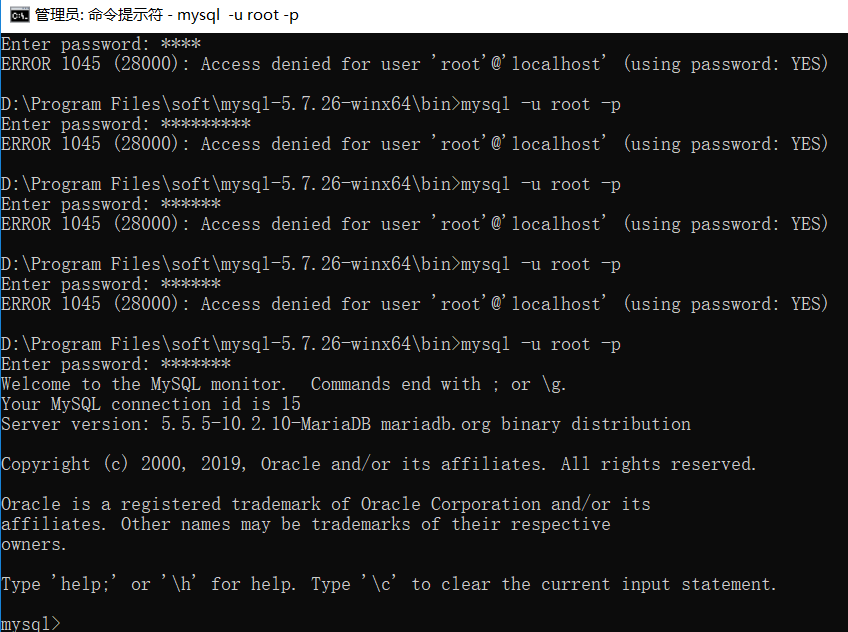

8. 查询用户密码:

+ 查询用户密码命令：mysql> select host,user,authentication_string from mysql.user;

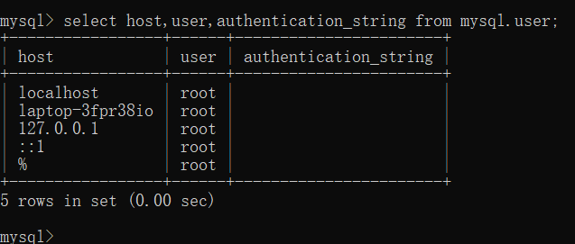

9. 设置（或修改）root用户密码：

+ 设置（或修改）root用户密码：mysql> update mysql.user set authentication_string=password("123456") where user="root";   #password("123456"),此处引号中的内容是密码，自己可以随便设置 Query OK, 1 row affected, 1 warning (0.00 sec) Rows matched: 1  Changed: 1  Warnings: 1 mysql> flush privileges;  #作用：相当于保存，执行此命令后，设置才生效，若不执行，还是之前的密码不变 Query OK, 0 rows affected (0.01 sec) 

10. 退出mysql 命令quit

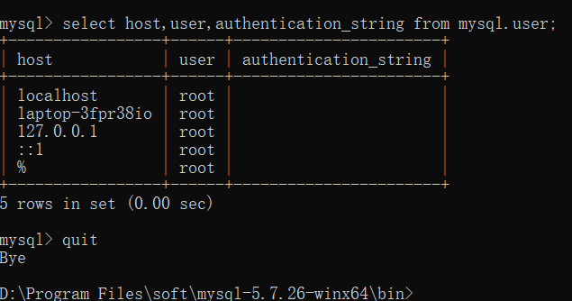


#### 参考链接

[MySQL 5.6 for Windows 解压缩版配置安装](https://jingyan.baidu.com/article/f3ad7d0ffc061a09c3345bf0.html)

[windows下安装Mysql—图文详解](https://www.cnblogs.com/reyinever/p/8551977.html)


**以上就是我关于 *MySQL-Windows10安装教程*  知识点的整理与总结的全部内容。**

==================================================================
#### 分割线
==================================================================

**博主为咯学编程：父母不同意学编程，现已断绝关系;恋人不同意学编程，现已分手;亲戚不同意学编程，现已断绝来往;老板不同意学编程,现已失业三十年。。。。。。如果此博文有帮到你欢迎打赏，金额不限。。。**

