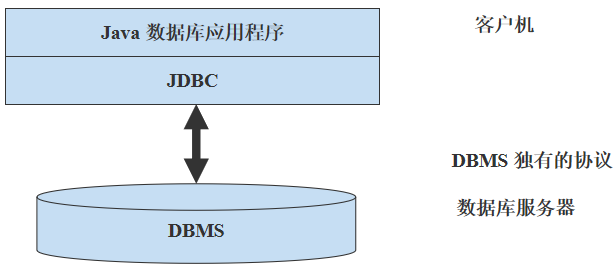
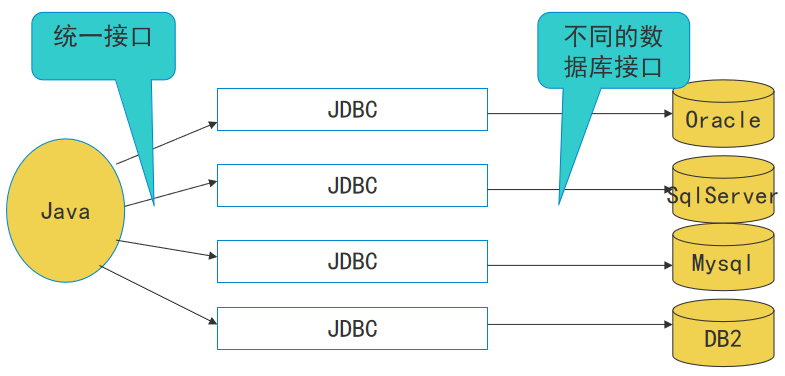
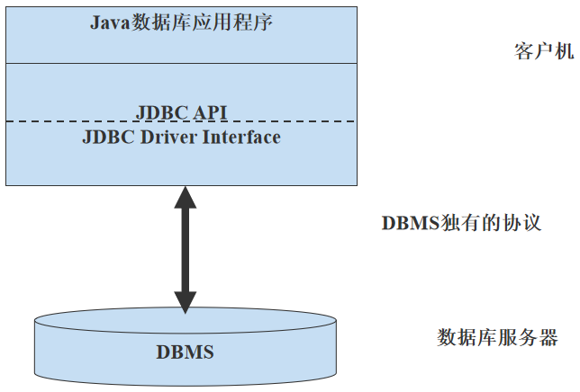
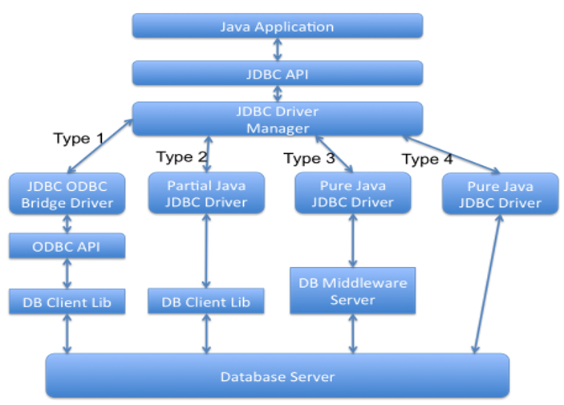

# 157-Java-JDBC与Java数据库编程基础.md

#### JDBC概述

+ 什么是JDBC
+ JDBC(Java DataBase Connectivity)
    + 称为Java数据库连接，它是一种用于数据库访问的应用程序API，由一组用Java语言编写的类和接口组成，有了JDBC就可以用同一的语法对多种关系数据库进行访问，而不用担心其数据库操作语言的差异。
    + 有了JDBC，就不必为访问Mysql数据库专门写一个程序，为访问Oracle又专门写一个程序等等。





+ JDBC体系结构
+ JDBC的结构可划分为两层：
    + JDBC Driver Interface(驱动程序管理器接口)
    + JDBC API



+ JDBC优缺点
    + 优点：
        + JDBC使得编程人员从复杂的驱动器调用命令和函数中解脱出来，可以致力于应用程序中的关键地方。
        + JDBC支持不同的关系数据库，这使得程序的可移植性大大加强。
        + JDBC API是面向对象的，可以让用户把常用的方法封装为—个类，以备后用
    + 缺点：
    + 使用JDBC，访问数据记录的速度会受到一定程度的影响。
    + JDBC结构中包含不同厂家的产品，这就给更改数据源带来了很大的麻烦。
+ JDBC核心接口与类
+ JDBC核心类库包含在java.sql包中。
    + 类
        + DriverManager：负责管理JDBC驱动程序。使用JDBC驱动程序之前，必须先将驱动程序加载并注册后才可以使用，同时提供方法来建立与数据库的连接。 
        + SQLException－有关数据库操作的异常
    + 接口:
        + Connection：特定数据库的连接（会话）。在连接上下文中执行SQL语句并返回结果。
        + PreparedStatement：表示预编译的 SQL 语句的对象。
        + Statement：用于执行静态 SQL 语句并返回它所生成结果的对象。
        + ResultSet ：表示数据库结果集的数据表，通常通过执行查询数据库的语句生成 。
        + CallableStatement ：用于执行 SQL 存储过程的接口 。 

#### 创建JDBC应用

+ 创建JDBC应用程序的步骤
    + 1. 载入JDBC驱动程序
    + 2. 定义连接URL
    + 3. 建立连接
    + 4. 创建Statement对象
    + 5. 执行查询或更新
    + 6. 结果处理
    + 7. 关闭连接

+ 数据库驱动程序
    + 数据库驱动程序分类
        + Type 1: jdbc-odbc桥
            + 把JDBC API调用转换成ODBC API 调用, 然后ODBC API调用针对供应商的ODBC 驱动程序来访问数据库, 即利用JDBC- ODBC 桥通过ODBC来存储数据源 。
        + Type 2: 本地API驱动 
            + 本地api驱动直接把jdbc调用转变为数据库的标准调用再去访问数据库. 这种方法需要本地数据库驱动代码。讯。
        + Type 3: 网络协议驱动 
            + 它使用一种与具体数据库无关的协议将数据库请求发送给一个中间服务器。
        + Type 4: 本地协议驱动
            + 这种驱动直接把jdbc调用转换为符合相关数据库系统规范的请求.由于4型驱动写的应用可以直接和数据库服务器通讯，这种类型的驱动完全由java实现，因此实现了平台独立性。
        + 通常开发中多采用第四种方式，这种驱动不需要先把jdbc的调用传给odbc或本地数据库接口或者是中间层服务器，所以它的执行效率是非常高的驱动
+ 数据库驱动程序



+ 数据库驱动程序
    + 各数据库厂商均提供对 JDBC 的支持，即提供数据库连接使用的驱动程序文件
    + 需要为数据库应用程序正确加载驱动程序文件以获得数据库连接，实施操作
    + Oracle 数据库的 JDBC 驱动程序文件 “ojdbc14.jar”（Oracle官方网站下载）
+ 加载 JDBC 驱动程序
    + Class 类中提供加载驱动程序的方法：

```
public static Class forName(String className) 
		throws ClassNotFoundException
```

className－表示类的描述符的字符串
+ Oracle 驱动的类描述符为：

```
oracle.jdbc.driver.OracleDriver
```

+ 加载 JDBC 驱动程序
    + 示例：
    + 在工程主类 JdbcOracleTest 的 main 方法中增加加载 Oracle 驱动的代码：  
        + 声明表示 Oracle 驱动类描述符的字符串变量 driver
        + 调用 Class 类的静态方法 forName 加载该驱动（注意异常处理）
+ 建立与数据库的连接
    + DriverManager 类提供 getConnection 方法可获得指定数据库的连接对象：
```
public static Connection getConnection
	(String url, String userName, String password) 
		throws SQLException
```
+ Oracle 数据库的 url 格式为：
```
jdbc:oracle:thin:@<主机名或IP>:1521:<数据库名>
```
+ 建立与数据库的连接
    + 示例
    + 修改类 JdbcOracleTest 的 main 方法：  
        + 声明表示指定数据库url的字符串变量 url
        + 分别声明表示用户名和口令的字符串变量 userName 和 password，分别初始化为 "SCOTT" 和 "TIGER“
        + 声明Connection接口对象con，赋值为 DriverManager类的getConnection方法的返回值
        + 输出打印 “数据库连接成功” 的提示信息
+ 获得 Statement 对象
        + Connection接口中提供可获得 Statement 对象的方法：
```
Statement createStatement() throws SQLException
```
+ 可调用重载的 createStatement 方法，可指定参数，设置数据库操作结果的相关属性。

+ 执行 SQL 语句
    + Statement接口提供可执行 SQL 命令的方法：
```
boolean execute(String sql) throws SQLException
ResultSet executeQuery(String sql) throws SQLException 
int executeUpdate(String sql) throws SQLException 
```

+ 执行 SQL 语句
    + 示例（查询）
    + 在工程主类 JdbcOracleTest 的 main 方法中增加操作数据库的代码：  
        + 获得可发送SQL命令的Statement对象st 
        + 调用对象st的excuteQuery方法发送SQL查询命令，查询SCOTT下的表DEPT，获得所有记录数据，返回结果集对象rs
    + 在工程主类 JdbcOracleTest 的 main 方法中增加操作数据库的代码：  
    + 获得可发送SQL命令的Statement对象st 
    + 实现对数据库增删改查操作
+ 操作结果集对象
    + ResultSet接口提供可对结果集进行操作的方法：  
    + 移动结果集操作指针：
```
boolean next() throws SQLException
```
指定数据类型根据传入列的名字获取指定列的值：
```
Xxx getXxx(String columnName) throws SQLException
```
指定数据类型根据传入列的编号获取指定列的值：

```
Xxx getXxx(1) throws SQLException
```
+ SQL类型对应Java数据类型

|SQL Type	|Java Type|
| -------- | -------- |
|CHAR	|String|
|VARCHAR	|String|
|LONGVARCHAR	|String|
|NUMERIC|	java.math.BigDecimal|
|DECIMAL|	java.math.BigDecimal|
|BIT|	boolean|
|TINYINT|	byte|
|SMALLINT|	short|
|INTEGER|	int|

+ ResultSet接口的getXxx 方法

|Method	|Java Technology Type Returned|
| ------ | -------------|
|getInt|	int|
|getLong|	long|
|getObject|	Object|
|getShort|	short|
|getString|	java.lang.String|
|getTime	|java.sql.Time|
|getTimestamp|	java.sql.Timestamp|
|getUnicodeStream|	java.io.InputStream of Unicode characters| 

+ 示例
+ 在工程主类 JdbcOracleTest 的 main 方法中增加处理结果集的代码：  
    + 以rs对象的next()方法作为while循环的条件，调用对象rs的getXxx方法，指定列名和类型，获取结果集对象中DEPT表的所有数据，并打印输出。

+ 关闭操作对象及连接
+ 可调用接口ResultSet、Statement、Connection 中的关闭方法，立即释放数据库和 JDBC 相关资源：

```
void close() throws SQLException
```
+ 示例
+ 在工程主类 JdbcOracleTest 的 main 方法中增加关闭数据库操作对象的代码：  
    + 关闭结果集对象 rs 
    + 关闭 Statement 对象 st
    + 关闭 Connection 对象 con
+ JDBC日期时间处理
+ 对于数据库种不同的时间类型，要分别采用与之相对应的Java包装类来存取:
    + 日期类型用java.sql.Date
    + 时间类型用java.sql.Time
    + 日期/时间类型用java.sql.Timestamp； 
    + getTimestamp()可以把年月日时分秒都取出来，getDate()只能取出年月日，getTime()只能取出时分秒。
+ JDBC的日期/时间类型转换为字符串
    + Timestamp timeStamp = //通过数据库访问获取到该数据
    + SimpleDateFormat sdf = new SimpleDateFormat("yyyy-MM-dd HH:mm:ss"); 
    + String str = sdf.format(timeStamp); 
+ java.sql.Timestamp如何转换为java.util.Date
    + java.sql.Timestamp是java.util.Date的子类，不需要做任何转换直接赋值即可： 
    + java.sql.Timestamp ts; 
    + java.util.Date utilDate; 
    + utilDate = ts; 
+ java.util.Date如何转换为java.sql.Timestamp
    + java.util.Date是java.sql.Timestamp的父类，要这样转换： 
    + java.sql.Timestamp ts; 
    + java.util.Date utilDate; 
    + ts.setTime(utilDate.getTime());

#### PreparedStatement

+ PreparedStatement接口
    + PreparedStatement接口是Statement接口的子接口，允许使用不同的参数多次执行同样的 SQL 语句。
    + Connection接口提供创建PreparedStatement对象的方法，可指定SQL语句：

```
PreparedStatement prepareStatement(String sql) 
			throws SQLException
```
```
PreparedStatement pstmt = con.prepareStatement
	("INSERT INTO EMP VALUES(?,?)");
pstmt.setInt(1,  99);
pstmt.setString(2,  "Tom");
 int count = pstmt.executeUpdate( );
```
+ PreparedStatement接口setXxx 方法

|Method	|SQL Type|
| ----- | ------ |
|setASCIIStream	|LONGVARCHAR produced by an ASCII stream|
|setBigDecimal	|NUMERIC|
|setBinaryStream	|LONGVARBINARY|
|setBoolean|	BIT|
|setByte|	TINYINT|
|setBytes|	VARBINARY or LONGVARBINARY (depending on the size relative to the limits on VARBINARY)|
|setDate|	DATE|
|setDouble	|DOUBLE|
|setFloat|	FLOAT|
|setInt|	INTEGER|
|setLong|	BIGINT|
|setNull|	NULL|
|setObject|	The given object that is converted to the target SQL type  before being sent |
|setShort	|SMALLINT|
|setString|	VARCHAR or LONGVARCHAR (depending on the size relative to the driver’s limits on VARCHAR)|
|setTime	|TIME|
|setTimestamp	|TIMESTAMP|

+ 示例
+ 修改 JdbcOracleTest 类代码，尝试使用 PreparedStatement 类发送 SQL 命令，实现对数据库的操作。

+ **PreparedStatement接口优点:**
    + 可动态设置参数
    + 增加了预编译功能
    + 提高执行速度


**以上就是我关于 *Java-JDBC与Java数据库编程基础*  知识点的整理与总结的全部内容。**

==================================================================
#### 分割线
==================================================================

**博主为咯学编程：父母不同意学编程，现已断绝关系;恋人不同意学编程，现已分手;亲戚不同意学编程，现已断绝来往;老板不同意学编程,现已失业三十年。。。。。。如果此博文有帮到你欢迎打赏，金额不限。。。**

