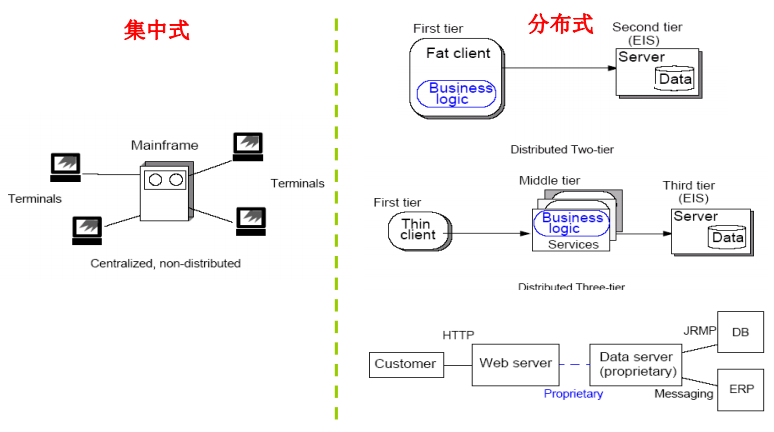
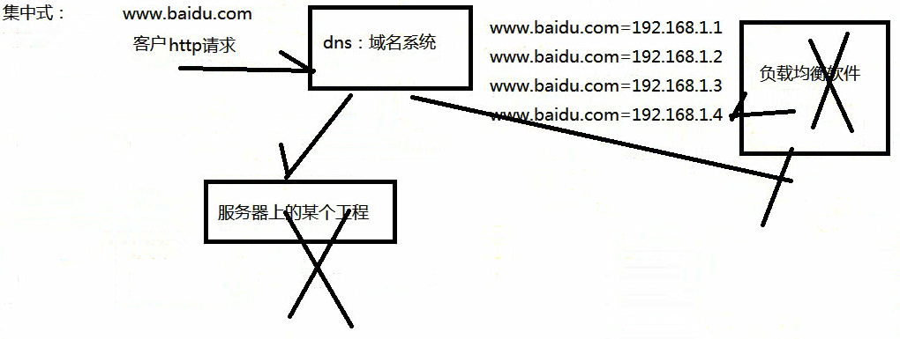

# 158-Java-集中式&分布式.md

+  分布式应用（distributed application ）
    + 由不同的运行于分离的运行环境下的组件构成的应用程序，通常是在不同的平台上通过网络互联起来 
    + 建立在网络之上的软件系统

+ 典型的分布式应用
    + 双端式（客户机－服务器 Client/Server）
    + 三端式（客户机－中间件－服务器 Client/Middleware/Server） 
    + 多端式（客户机－多组件－多服务器 Client/Multiple Middleware/Multiple server）

+ 集中式应用与分布式应用

#### 拓展链接

[分布式系统和集中式系统概念的简单易懂理解](https://www.jianshu.com/p/1953fac74b54)

[Java编程良心推荐——分布式架构原理解析](https://www.jianshu.com/p/ba5f718b75cc)

**以上就是我关于 *Java-集中式&分布式*  知识点的整理与总结的全部内容。**

==================================================================
#### 分割线
==================================================================

**博主为咯学编程：父母不同意学编程，现已断绝关系;恋人不同意学编程，现已分手;亲戚不同意学编程，现已断绝来往;老板不同意学编程,现已失业三十年。。。。。。如果此博文有帮到你欢迎打赏，金额不限。。。**

