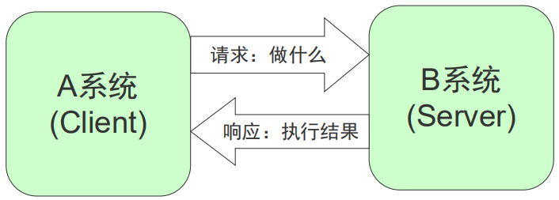
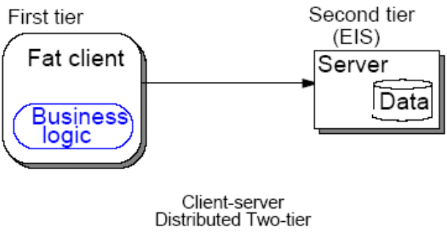
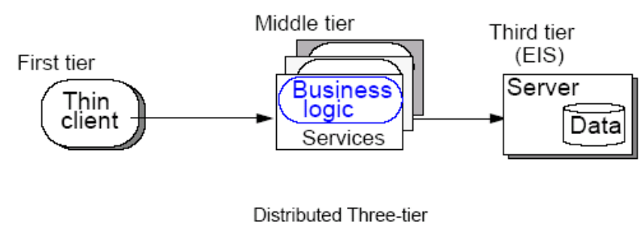

# 159-Java-两层结构&三层结构.md

+ C/S模式
    + 即 客户机/服务器 结构
    + 早期的软件系统多以此作为首选设计标准。服务器通常采用高性能的PC、工作站或小型机，并采用大型数据库系统
    + 客户端安装专门的软件

+ 常见的C/S模式：
    + 数据库服务器
    + 网络游戏客户端/服务器端
    + QQ客户端/QQ服务器端

+ 两层结构
    + 通常所说的C/S结构

+ 三层结构

#### 拓展知识 

[两层结构与三层结构](https://blog.csdn.net/tangshuji/article/details/8465235)

**以上就是我关于 *Java-两层结构&三层结构*  知识点的整理与总结的全部内容。**

==================================================================
#### 分割线
==================================================================

**博主为咯学编程：父母不同意学编程，现已断绝关系;恋人不同意学编程，现已分手;亲戚不同意学编程，现已断绝来往;老板不同意学编程,现已失业三十年。。。。。。如果此博文有帮到你欢迎打赏，金额不限。。。**

