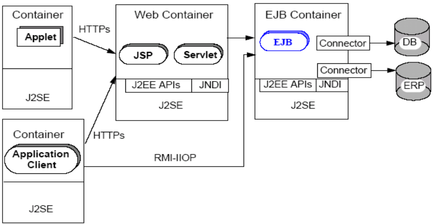

# 162-Java-JavaEE简介.md

+ JavaEE平台由一整套服务（SERVICES）、应用程序接口（APIS）和协议构成，它对开发基于Web的多层应用提供了功能支持。
    + JavaEE是一种框架和标准，框架类似API、库的概念，但是要超出它们。
    + 三类子技术标准：Web技术、EJB技术和JMS。
    + JavaEE的优越性
        + 基于Java技术，平台无关性表现突出。
        + 开放的标准，许多大型公司已经实现了对该规范支持的应用服务器。
        + 提供相当专业的通用软件服务。 
        + 提供了一个优秀的企业级应用程序框架，对快速高质量开发打下基础

+ JavaEE平台由一整套服务（SERVICES）、应用程序接口（APIS）和协议构成，它对开发基于Web的多层应用提供了功能支持。 
    + 13种核心技术

√ JDBC    √ JMS

√ JNDI    √ JAVA IDL

√ EJB     √ JTS

√ RMI     √ JTA

√ JSP     √ JAVA MAIL

√ Servlet √ JAF

√ XML

+ JavaEE容器：
    + 是用来管理组件行为的一个集合工具，组件的行为包括与外部环境的交互、组件的生命周期、组件之间的合作依赖关系等等。
    + 开发者编写的JavaEE应用程序组件运行在容器中

+ JavaEE应用服务器
    + 应用服务器定是指通过各种协议把商业逻辑曝露给客户端的程序。
    + 它提供了访问商业逻辑的途径以供客户端应用程序使用。
    + 能实现动态网页技术的服务器。

+ 常见的JavaEE容器： 
    + Web容器：包括JSP与Servlet组件，可使用EJB中的组件完成复杂的商务逻辑； 
    + EJB容器：包含组件EJB， EJB规范定义了一个开发和部署分布式商业逻辑的框架； 
    + Applet容器：包含组件Applet，即可使用JavaSE开发Applet； 
    + Application Client容器：包含组件Application Client。

+ JavaEE应用典型的层次结构
    + 客户层
        + 作用：客户进行操作的客户端。通常使用浏览器，也可以使用Java Application程序。
    + 中间层
    + Web层
        + 为Web用户提供应用系统的访问接口，接受客户的HTTP请求，调用后端处理逻辑，给客户做出HTTP响应。
    + 业务层
        + 提供应用系统的业务逻辑功能。
    + EIS层(Enterprise Information System)
        + 作用：存放应用系统的业务数据，通常为RDBMS。

+ JavaEE的中间层技术
    + Web层
    + Servlet
    + Java Web的基础技术，提供接受、处理Http请求做出Http响应，以及其它Web相关的功能。
    + JSP（Java Server Page）
    + 提供方便的生成动态页面的技术，需要翻译为Java源文件后编译执行，本质是Servlet。
    + 业务层
        + EJB（Enterprise JavaBean）
        + Java的服务器端组件技术

+ JavaEE典型的层次结构

**以上就是我关于 *Java-JavaEE简介*  知识点的整理与总结的全部内容。**

==================================================================
#### 分割线
==================================================================

**博主为咯学编程：父母不同意学编程，现已断绝关系;恋人不同意学编程，现已分手;亲戚不同意学编程，现已断绝来往;老板不同意学编程,现已失业三十年。。。。。。如果此博文有帮到你欢迎打赏，金额不限。。。**

