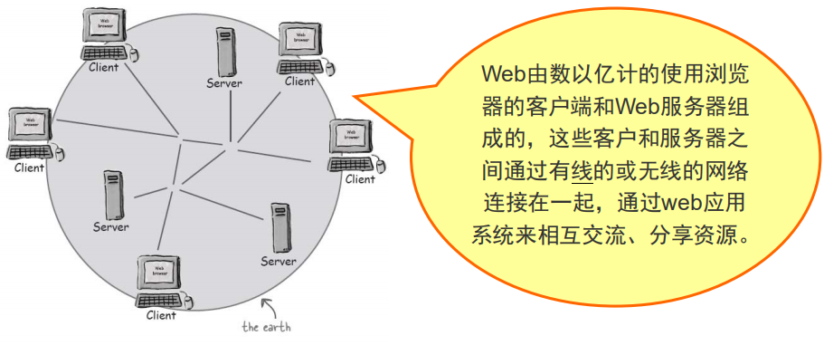
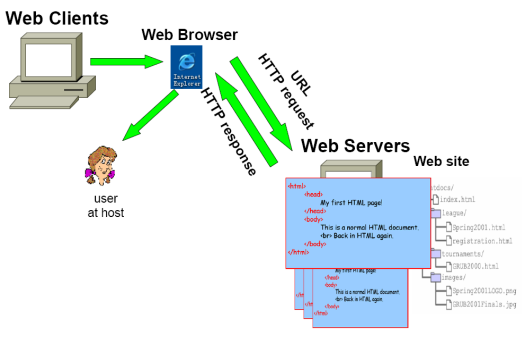
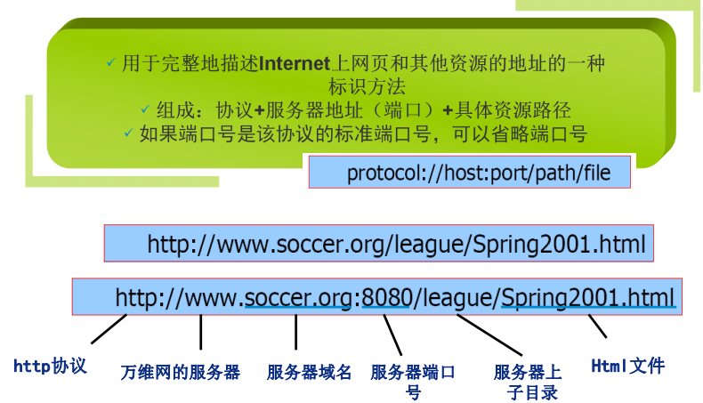
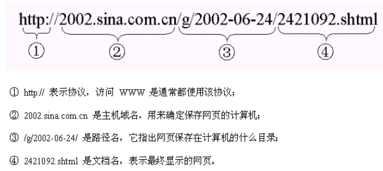
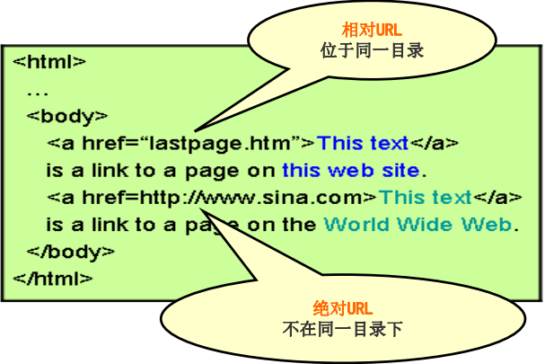
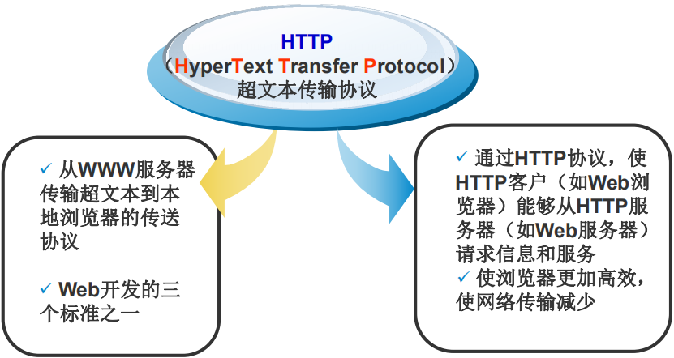
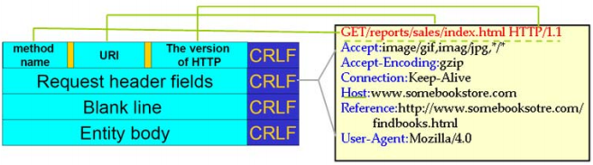
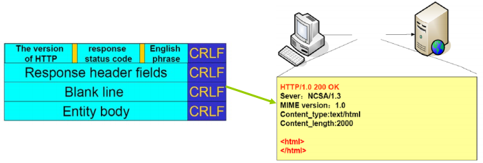
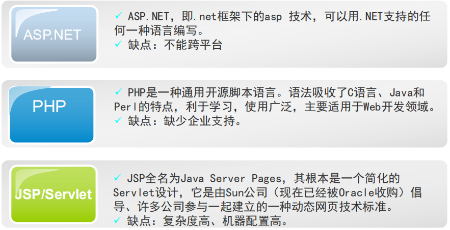

# 163-Java-WEB简介.md

+ Web访问处理过程
    + Web服务器（Web Server） 
        + Web服务器接收客户请求，然后向客户返回一些结果
    + Web客户端（Web Client） 
        + Web客户端允许用户请求服务器上的某个资源，并且向用户显示请求的结果
    + Web浏览器（Web Browser）

+ Web核心 — 三个标准
    + 统一资源标识符（URL），这是一个世界通用的负责给万维网上例如网页这样的资源定位的系统。
    + 超文本传送协议（HTTP），它负责规定浏览器和服务器怎样互相交流。
    + 超文本标记语言（HTML），作用是告诉浏览器向用户显示什么样的内容。
+ Web资源与URL
    + URL（Uniform Resource Locator）— 统一资源定位符

+ 绝对路径
    + 格式：协议：//计算机/文档名
    + 绝对URL是指资源的完整地址，在硬盘上的真正路径

+ 相对路径
    + 相对URL是指资源相对于当前页面的地址，它包含从当前页面指向目标页面位置的路径
    + 3种写法
        + 同一目录下 只需输入要链接的文件名
        + 上一级目录 在目录名和文件名前加“../”
        + 下一级目录 输入目录名和文件名，之间用“/”隔开

+ 相对路径与绝对路径

+ HTTP协议

+ HTTP请求格式

+ HTTP应答格式

+ Web应用（Web Application）
    + 基于HTTP协议的应用程序
    + Brower/Server的结构
    + 浏览器客户端：通过HTTP请求发送数据
    + 服务器：处理，并通过HTTP响应将结果显示给客户
    + 交互过程：HTTP请求与响应的过程

+  Web应用技术

**以上就是我关于 *Java-WEB简介*  知识点的整理与总结的全部内容。**

==================================================================
#### 分割线
==================================================================

**博主为咯学编程：父母不同意学编程，现已断绝关系;恋人不同意学编程，现已分手;亲戚不同意学编程，现已断绝来往;老板不同意学编程,现已失业三十年。。。。。。如果此博文有帮到你欢迎打赏，金额不限。。。**

