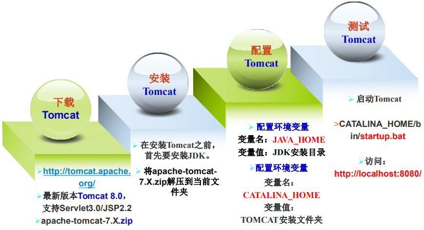
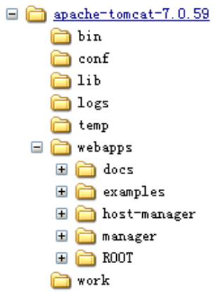
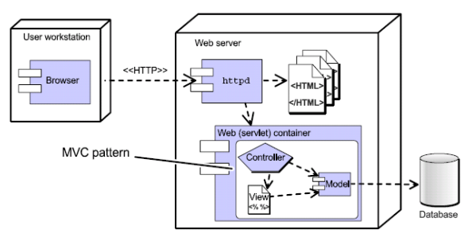
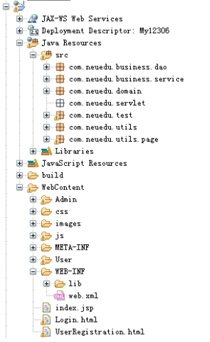

# 164-Java-Web应用程序结构.md

+ Tomcat简介
    + 免费的开放源代码的Java Web 应用服务器
    + 一种Servlet&JSP的容器
    + Apache 软件基金会（Apache Software Foundation）的Jakarta 项目中的一个核心项目，由Apache、Sun 和其他一些公司及个人支持。
+ Tomcat作用
    + Servlet容器：处理客户的HTTP请求，把请求传给Servlet，并把结果返回给客户。

+ Tomcat配置



+ Tomcat目录结构



|文件名| 说明|
| --- | --- |
|/bin |存放tomcat的脚本文件和tomcat运行必须的核心文件|
|/lib |存放tomcat服务器所需的各种jar文件|
|/conf| 存放tomcat的各种配置文件|
|/logs| 存放tomcat的日志文件|
|/temp| Java虚拟机处理临时文件用的文件夹|
|/webapps| 所有Web应用，或者说是一个个的WEB网站|
|/work |存放由JSP生成的servlet|

+ 修改用户名和密码
    + 编辑CATALINA_HOME/conf/tomcat-users.xml ，在 &lt;tomcat-users&gt; 元素中加入

```
<role rolename="manager-gui"/>
<user username="tomcat" password="s3cret" roles="manager-gui"/>
```
+ 修改tomcat服务器的端口号
    + 编辑CATALINA_HOME/conf/server.xml ，修改&lt;Connector port=“8080” protocol=“HTTP/1.1” &gt;元素，如下

```
<Connector port="8888" protocol="HTTP/1.1" 
 connectionTimeout="20000" 
 redirectPort="8443“
 />
```

+ 配置欢迎页面
    + 当用户请求的URI地址与ContextRoot匹配时，对应客户请求缺省的Web资源
    + 配置：在DD文件的根元素<web-app/>中添加子元素

```
<?xml version="1.0" encoding=“UTF-8”?>
<web-app …>
 <welcome-file-list>
 <welcome-file>index.html</welcome-file>
 </welcome-file-list> 
</web-app>
```

+ Java Web应用的组成
    + Java Web应用由一组HTML页面、Servlet、JSP和其它相关的Java类组成：
    + HTML等静态内容文件
    + 通常可以被用户直接访问
    + Java字节码文件（.class文件）
    + 应用程序代码，包括Servlet
        + 底层的支持库文件
            + jar文件
        + JSP
            + 应用程序代码，通常用于生成页面
        + 配置文件
            + 部署描述符（web.xml）及其它


+ Web应用标准目录结构

| 目录  | 描述 |
| ---- | ---- |
|/app_name |Web应用的根目录，所有HTML和 JSP文件都存放于此目录下|
|/app_name/WEB-INF| 存放web应用的发布描述文件 web.xml受保护的目录：里面的 文件不能被客户直接访问 |
| /app_name/WEB-INF/classes | 存放web应用中的java字节码文件 |
| /app_name/WEB-INF/lib | 存放web应用所需的各种jar文件 |
| /app_name/META-INF | 用来配置应用程序、扩展程序、类 加载器和服务mainfest.mf文件 |

+ Web应用的编写、部署和访问基本步骤
    + 构建Web应用目录
    + 编写相关文件：
        + HTML/JSP
        + Servlet
        + web.xml
    + 部署
    + 测试

+ Web应用的ContextRoot
    + Web应用的Context Root是URI的第一级逻辑路径
    + 在部署时设置
+ 确定Web资源的URL
    + HTML文件
        + http://主机名:端口号/<Context root>/Web应用中的相对路径如：http://localhost:8080/ums/index.html
    + JSP
        + 与静态文件相同
    + Servlet
        + 在web.xml文件中分配
    &lt; Context root &gt;…

+ 创建Servlet文件
    + 继承 java.servlet.http.HttpServlet
    + 覆盖父类的doXxx方法，在方法内完成处理代码
    + HttpServlet的doXxx方法
        + doGet
        + doPost
    + HttpServlet doXxx方法的参数
        + javax.servlet.http.HttpServletRequest（请求对象）
        + javax.servlet.http.HttpServletResponse（响应对象）

+ 配置Servlet文件
    + Web应用的部署描述符文件（DD, Deployment Descriptor） web.xml
    + 把URL映射到Servlet，在web.xml文件的<web-app/>元素中添加• &lt;servlet&gt;元素
    + &lt;servlet-mapping&gt;元素

```
<?xml version="1.0" encoding=“UTF-8"?>
<web-app …>
 <servlet>
 <servlet-name>HelloServlet</servlet-name>
 <servlet-class>com.neuedu.servlet.HelloServlet</servlet-class>
 </servlet>
 <servlet-mapping>
 <servlet-name>HelloServlet</servlet-name>
 <url-pattern>/HelloServlet</url-pattern>
 </servlet-mapping>
</web-app>
```

+ 使用集成开发工具
    + 编辑
    + 自动代码生成
    + 编译(编译成.class文件)
    + 打包
    + 与应用服务器的集成
    + 自动部署
    + 调试

+ 自动部署
    + 默认位置workspace\.metadata\.plugins\org.eclipse.wst.server.core\tmp0
    + 可以通过修改配置部署到Tomcat/webapps目录下

+ MVC（Model-View-Controller）
    + MVC是一种软件设计模式，它把系统分为3个模块：
        + 模型 (Model)
        + 视图 (View)
        + 控制器 (Controller)



+ 分层结构
    + 1.表现层：负责用户与系统的交互
        + 其中控制组件在C/S中的GUI中表现为Listener、B/S中通过Servlet/JSP实现。
    + 2.业务层：维护逻辑业务，系统的核心部分
        + 一般命名为xxxService
    + 3.数据访问层（持久层）：负责与数据库的操作
        + 一般命名为xxxDAO




**以上就是我关于 *Java-Web应用程序结构*  知识点的整理与总结的全部内容。**

==================================================================
#### 分割线
==================================================================

**博主为咯学编程：父母不同意学编程，现已断绝关系;恋人不同意学编程，现已分手;亲戚不同意学编程，现已断绝来往;老板不同意学编程,现已失业三十年。。。。。。如果此博文有帮到你欢迎打赏，金额不限。。。**

