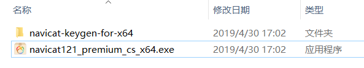
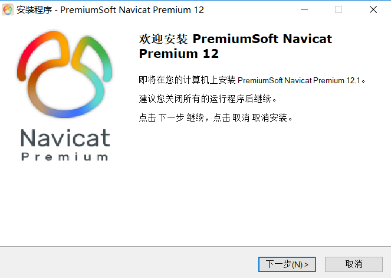
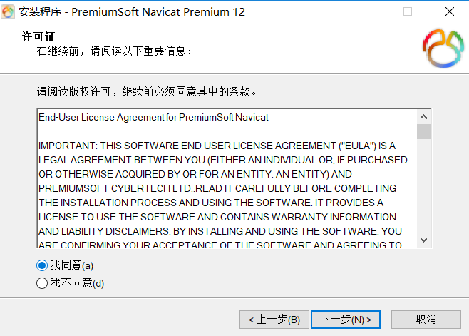
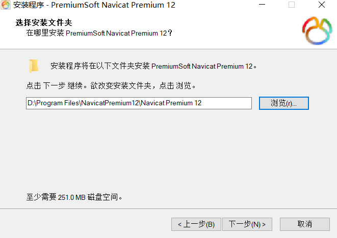
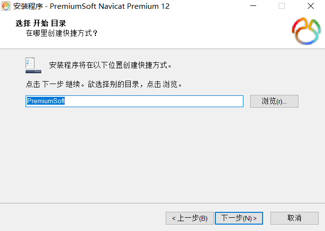
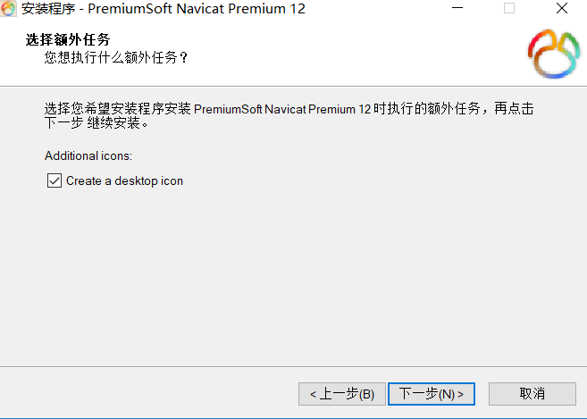
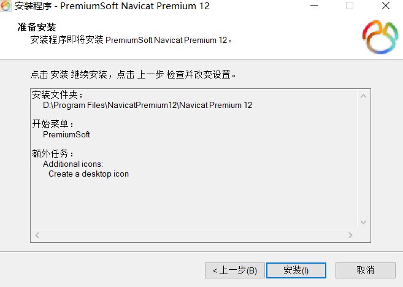
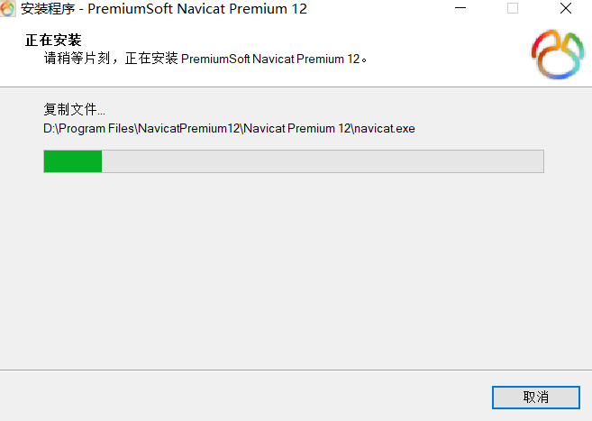
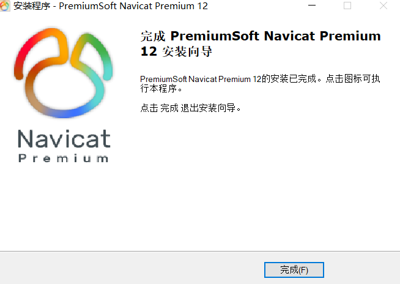

# 2-MySQL可视化工具premiumSoft Navicat Premium 12的安装步骤.md

1. 首先下载对应的安装包并解压

2. 双击.exe 文件

但以上方法均需要注册，所以我最终放弃咯。。。。参考的[一个大神的第三种方法](https://blog.csdn.net/weixin_40845165/article/details/84076958)

#### 拓展链接

[Navicat Premium 12注册码与破解解决方案](https://blog.csdn.net/weixin_40845165/article/details/84076958)

[Navicat简单使用方法](https://blog.csdn.net/sisure_shen/article/details/81042254)

[Navicat Premium基本使用](https://blog.csdn.net/yangchenju/article/details/80633055)

**以上就是我关于 *MySQL可视化工具premiumSoft Navicat Premium 12的安装步骤*  知识点的整理与总结的全部内容。**

==================================================================
#### 分割线
==================================================================

**博主为咯学编程：父母不同意学编程，现已断绝关系;恋人不同意学编程，现已分手;亲戚不同意学编程，现已断绝来往;老板不同意学编程,现已失业三十年。。。。。。如果此博文有帮到你欢迎打赏，金额不限。。。**

